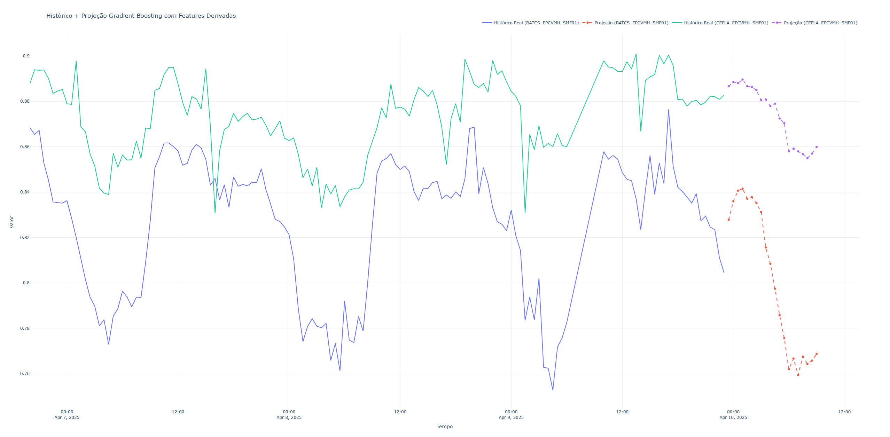

# 🧠 Gradient Boosting Predictor API

Uma API para previsão de séries temporais multivariadas usando **HistGradientBoostingRegressor** com suporte a múltiplas dimensões e projeções futuras.

---

## 📋 Requisitos do Sistema

- Docker Desktop
- Python 3.9+ (opcional para testes locais)
- Não requer GPU

---

## 📂 Estrutura do Projeto

```
.
├── Dockerfile                  # Ambiente Docker para execução da API
├── app.py                      # Servidor Flask com endpoint de inferência
├── ia_model.py                 # Classe com lógica de modelagem e predição
├── requirements.txt            # Dependências do projeto
├── base.json                   # Exemplo de entrada para teste da API
├── README.md                   # Este documento
```

---

## 🧠 Sobre o Modelo

Este projeto utiliza:

- `HistGradientBoostingRegressor` da `sklearn.ensemble`
- Encapsulado com `MultiOutputRegressor` para lidar com múltiplas variáveis dependentes
- Feature engineering automático com:
  - Diferença de 1 período (`diff1`)
  - Médias móveis de 3 e 5 períodos (`ma3`, `ma5`)
- Normalização com `MinMaxScaler`

---

## 🖼️ Exemplo de Resultado Visual

A imagem abaixo ilustra a saída esperada da previsão feita com o modelo Gradient Boosting:



---

## 🛠️ Instalação e Execução com Docker

### 1. Clonar o repositório

```bash
git clone <repository-url>
cd gradient-boosting-api
```

### 2. Construir a imagem Docker

```bash
docker build -t gb-predictor .
```

### 3. Executar a API

```bash
docker run -p 5000:5000 gb-predictor
```

---

## 🧪 Teste com `curl`

```bash
curl -X POST http://localhost:5000/predict \
-H "Content-Type: application/json" \
-d @base.json
```

---

## 📡 Endpoint da API

### `POST /predict`

#### Payload de entrada:

```json
{
  "n_periodos_compar": 20,
  "taxa_de_analise": 0.8,
  "data": [
    {"__time": "2025-04-10T00:00:00", "sensor1": 123, "sensor2": 456}
  ]
}
```

> A coluna `__time` será usada como referência temporal.

---

#### Resposta esperada:

```json
{
  "taxa_de_erros_por_dimensao": {
    "sensor1": 0.0023,
    "sensor2": 0.0081
  },
  "data": [
    {"timestamp": "2025-04-10T01:00:00", "sensor1": 125.5, "sensor2": 451.0}
  ]
}
```

---

## 📊 Visualização (opcional)

Você pode gerar um gráfico interativo com Plotly executando o script `ia.py` (fora do container):

```bash
python ia.py
```

O arquivo `grafico_interativo_YYYYMMDD_HHMMSS.html` será gerado e pode ser aberto no navegador.

---

## 🧪 Testes Locais

Você pode testar o módulo manualmente com:

```python
from ia_model import IAGradientBoostingPredictor

predictor = IAGradientBoostingPredictor(n_periodos=20, taxa_de_analise=0.8)
df_resultado, erros = predictor.process_and_predict(json_data)
```
---

## 📊 Visualização (opcional)

Você pode gerar um gráfico interativo com Plotly executando o script `ia.py` (fora do container):

```bash
python ia.py
```

O arquivo `grafico_interativo_YYYYMMDD_HHMMSS.html` será gerado e pode ser aberto no navegador.

---

## 🔍 Solução de Problemas

### Porta 5000 já está em uso?

```bash
lsof -i :5000          # Linux/macOS
netstat -ano | findstr :5000  # Windows
```

---

## 📄 Licença

Este projeto está sob a licença MIT. Consulte o arquivo `LICENSE` para mais detalhes.


